# Procédure de Déploiement d'Infrastructure Hackathon

## Vue d'ensemble

Cette docu
mentation décrit la procédure complète de déploiement de l'infrastructure Hackathon sur le homelab Proxmox hébergé chez Enzo. L'infrastructure est accessible via un tunnel VPN WireGuard et comprend 4 conteneurs LXC (WebServer, BDD, Monitoring, Backup) et 1 machine virtuelle FireWall (PfSense).

**Infrastructure hébergée :** Homelab Proxmox - Enzo <br>
**Pool d'infrastructure :** hackathon (ID 100XXX) <br>
**Système d'exploitation par défaut :** Debian 13 Trixie 

---

## 1. Accès à l'Infrastructure

### 1.1 Accès VPN - WireGuard

L'accès au réseau de l'infrastructure se fait exclusivement via un tunnel VPN WireGuard.

**Procédure :**
1. Demander un bail WireGuard à Enzo
2. Recevoir le fichier de configuration WireGuard (bail de 2 jours)
3. Installer le client WireGuard sur votre machine
4. Importer la configuration fournie
5. Activer la connexion VPN

**Durée du bail :** 2 jours (module Hackathon)


> **Prérequis :** Cette étape est obligatoire avant toute accession au Proxmox

---

## 2. Accès Proxmox

### 2.1 Création des comptes utilisateurs

Chaque utilisateur disposant d'un accès à l'infrastructure possède un compte Proxmox dédié.

**Caractéristiques des comptes :**
- Bail de 2 jours (expiration automatique après 2 jours)
- Accès limité au pool hackathon
- Permissions restreintes (voir section 2.2)


### 2.2 Permissions utilisateurs

Les utilisateurs disposent des permissions suivantes sur le pool hackathon :

**Permissions autorisées :**
- Visualiser le pool hackathon et les machines associées
- Administrer les machines (démarrer, arrêter)
- Accéder à la console de gestion
- Appliquer certaines personnalisations (configuration mineure)

**Permissions restreintes :**
- Création/suppression de LXC : Réservée à Enzo (gestion architecturale)
- Création/suppression de VM : Réservée à Enzo (gestion architecturale)
- Modification de l'architecture réseau : Réservée à Enzo

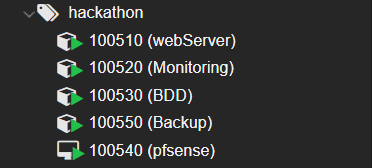


> **Note :** L'architecture de l'infrastructure est réglementée. Seul Enzo peut créer ou modifier les conteneurs et machines virtuelles.

---

## 3. Déploiement des Conteneurs LXC

### 3.1 Conventions de nommage et d'ID

L'infrastructure Proxmox respecte les conventions d'ID suivantes :

- Format ID : `100XXX` où `XXX` correspond à l'environnement/pool
- Pour le pool hackathon : `1005XX` (ex : 100510, 100520, ...)

**Conteneurs déployés :**
- WebServer (ID : 100510)
- BDD (ID : 100520)
- Monitoring (ID : 100530)
- Backup (ID : 100550)

### 3.2 Paramètres de création des LXC

#### Étape 1 : Configuration initiale
- **Pool :** hackathon
- **Clé SSH :** Configuration publique fournie (à définir lors de la création)
- **Template :** Debian 13 Trixie

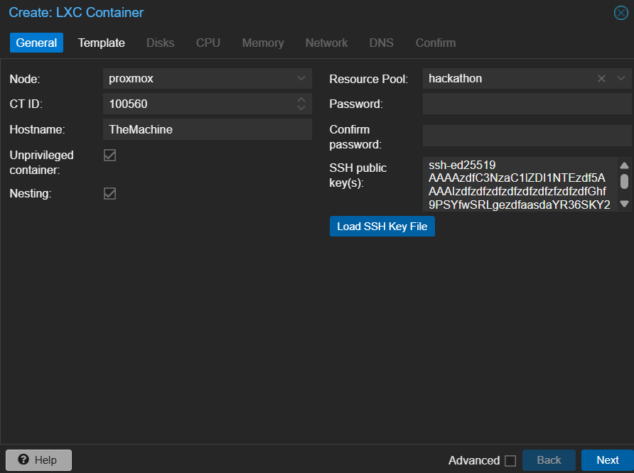

#### Étape 2 : Configuration du template

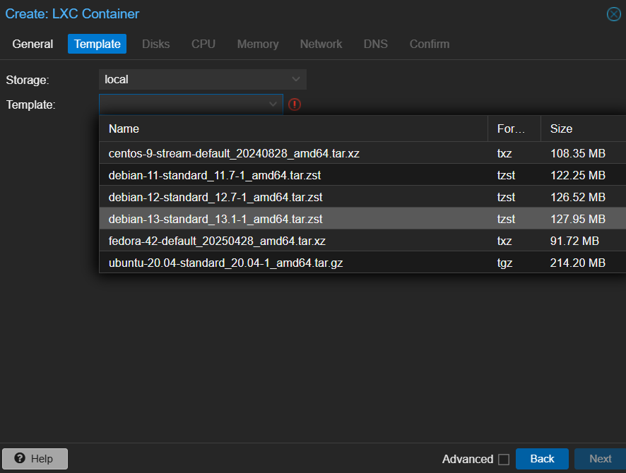

#### Étape 3 : Configuration du stockage disque

Les besoins disque s'adaptent selon la fonction du conteneur :

| Conteneur   | Stockage | Justification          |
|-------------|----------|------------------------|
| WebServer   | 20 Go    | Application web        |
| BDD         | 100 Go   | Base de données        |
| Monitoring  | 30 Go    | Logs et métriques      |
| Backup      | 300 Go   | Stockage des backups   |

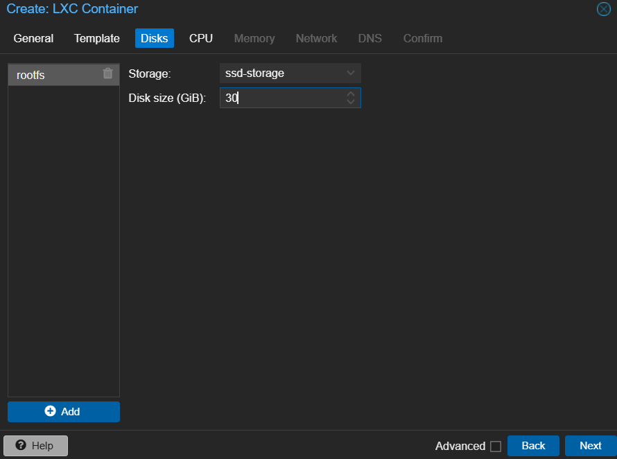

**Convention de stockage :** Respecter les conventions d'infrastructure en place et adapter selon les besoins.

#### Étape 4 : Allocation CPU et mémoire

Les ressources s'adaptent selon la charge anticipée :

| Conteneur   | vCores | RAM   |
|-------------|--------|-------|
| WebServer   | 2      | 2 Go  |
| BDD         | 2      | 2 Go  |
| Monitoring  | 2      | 2 Go  |
| Backup      | 2      | 2 Go  |

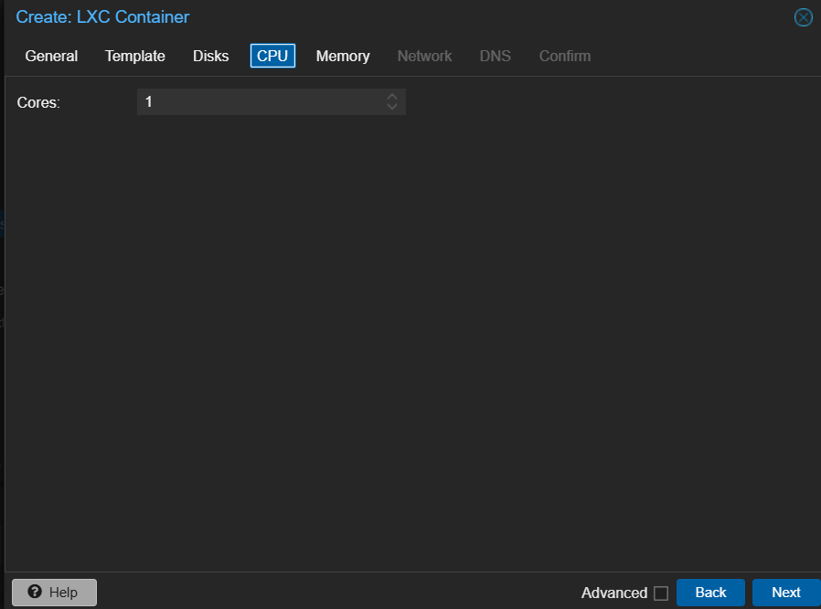
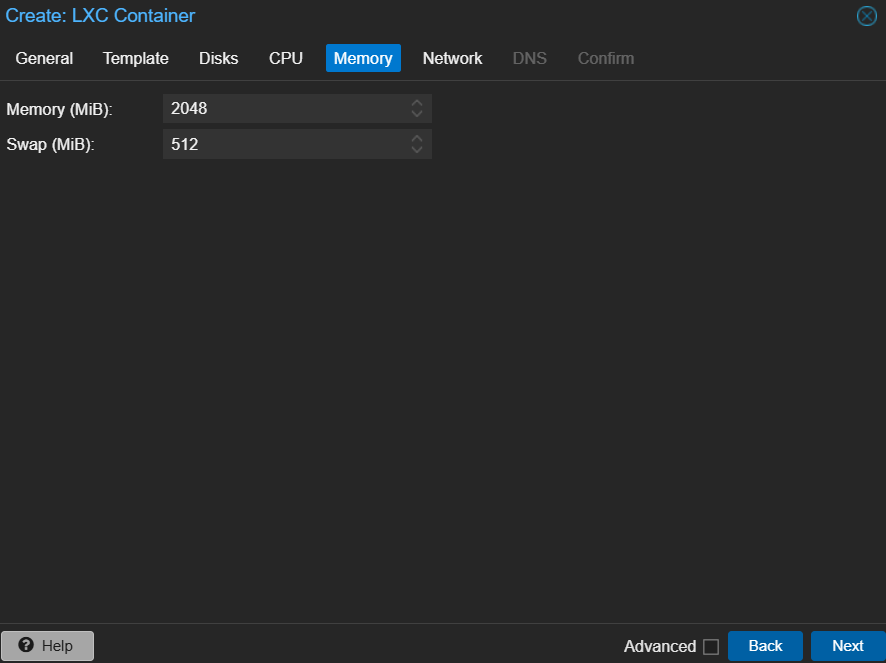

#### Étape 5 : Configuration réseau

- **Réseau :** Sélectionner le réseau approprié pour le pool hackathon
- **Adressage :** DHCP activé
- **Bail DHCP :** Automatiquement attribué à chaque conteneur
- **Documentation réseau :** Les IPs attribuées apparaissent automatiquement dans les notes Proxmox

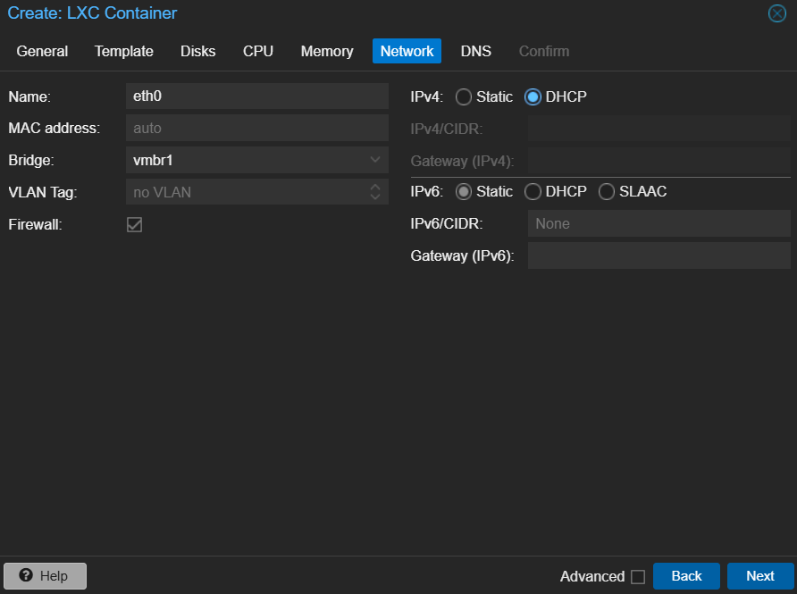
Et l'arriver de l'addressage DHCP dans les notes Proxmox :
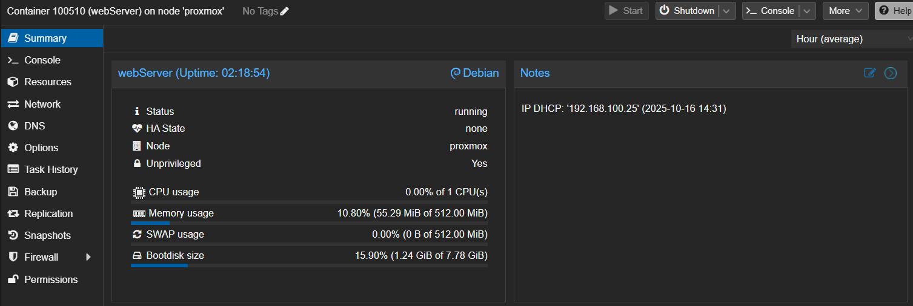

### 3.3 Installation et configuration commune des LXC

Tous les conteneurs suivent la même procédure d'installation et de configuration :

#### Étape 1 : Mise à jour du système
```bash
apt update
apt upgrade -y
```

#### Étape 2 : Configuration SSH
- Authentification par clé SSH uniquement (password login désactivé)
- Accès root autorisé uniquement via clé SSH
- Désactiver l'authentification par mot de passe dans SSH

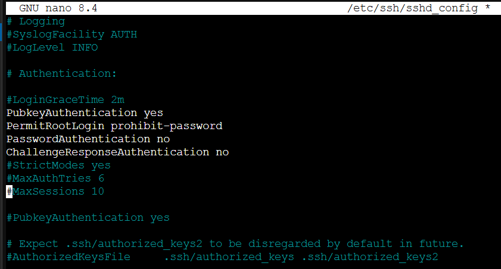

#### Étape 3 : Installation de Docker et Docker Compose
```bash
# Mise à jour des paquets
apt install -y ca-certificates curl gnupg lsb-release

# Ajout la clé GPG officielle
mkdir -p /etc/apt/keyringssystemctl enable docker
curl -fsSL https://download.docker.com/linux/debian/gpg | gpg --dearmor -o /etc/apt/keyrings/docker.gpg

# Ajout du repository Docker
echo "deb [arch=$(dpkg --print-architecture) signed-by=/etc/apt/keyrings/docker.gpg] https://download.docker.com/linux/debian $(lsb_release -cs) stable" | tee /etc/apt/sources.list.d/docker.list > /dev/null
```
```bash
# Mise à jour des paquets
apt update

# Installation de  Docker Engine
apt install -y docker-ce docker-ce-cli containerd.io docker-buildx-plugin docker-compose-plugin

# Démarrer et activer Docker
systemctl start docker
systemctl enable docker
```

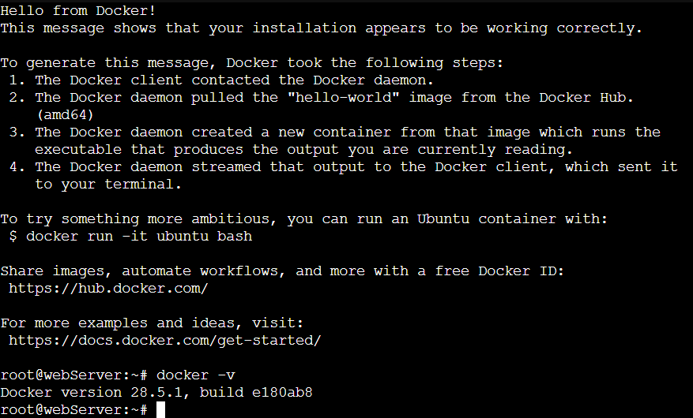

#### Étape 4 : Snapshot de référence

Une fois l'installation complète, procéder à un snapshot du conteneur dans son état stable :
- **Objectif :** Point de référence stable pour redéploiements rapides
- **Bénéfice :** Éviter une réinstallation complète en cas de besoin
- **Naming :** Snapshot nommé `base-install` ou `stable-reference`

![Snapshot de référence créé]
![dockercompose-install.png]

---

## 4. Déploiement de la Machine Virtuelle - PfSense Firewall

### 4.1 Conventions de nommage et d'ID

La machine virtuelle firewall suit les mêmes conventions d'ID que les LXC :

- **Format ID :** `100XXX` (pool hackathon = 100500)
- **VM ID :** 100540
- **Nom :** PfSense-Firewall

### 4.2 Paramètres de création de la VM

#### Étape 1 : Configuration initiale
- **Pool :** hackathon
- **ISO :** Netgate PfSense 2.8
- **Système d'exploitation :** PfSense (FreeBSD based)

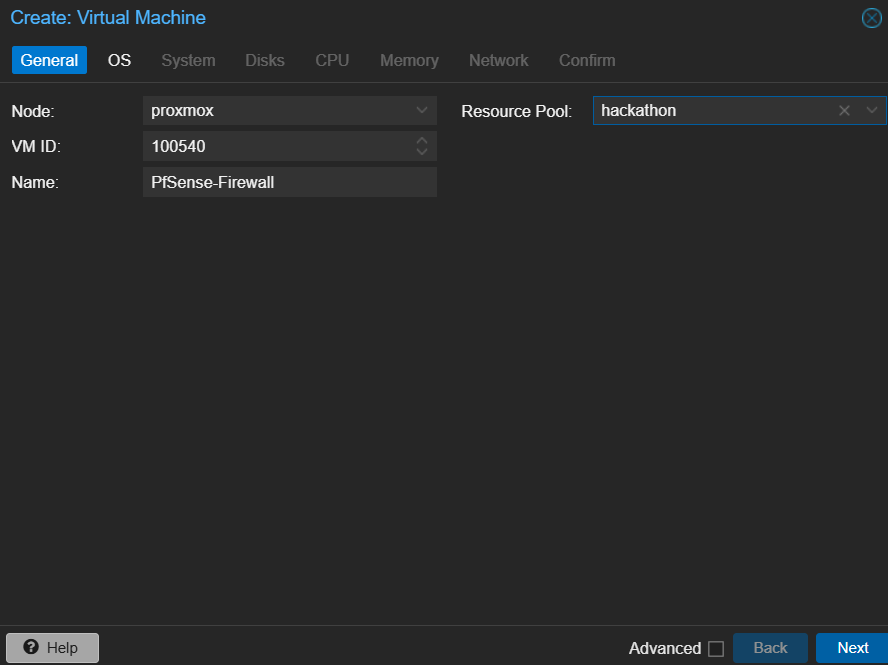

#### Étape 2 : Sélection de l'ISO

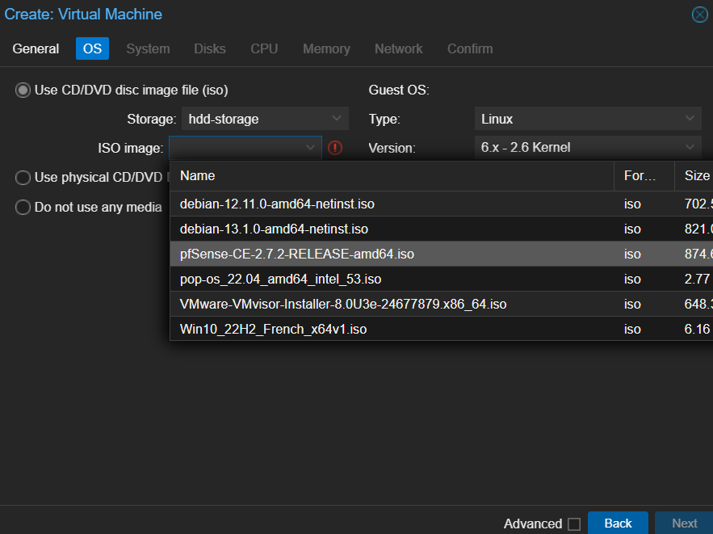

#### Étape 3 : Configuration système

Configuration minimale appropriée pour les besoins du firewall :
- **Type de processeur :** Adapté à la performance requise
- **BIOS :** Configuration standard Proxmox
- Autres paramètres système au minimum nécessaire

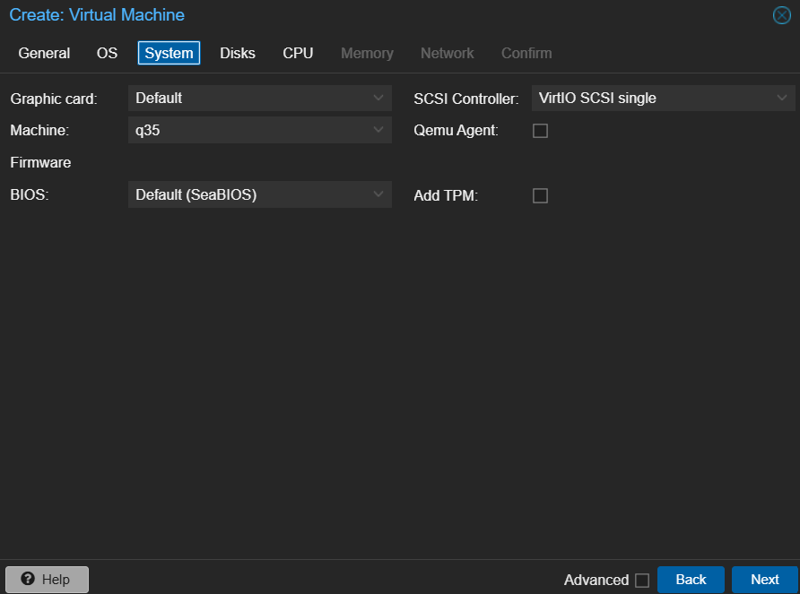

#### Étape 4 : Configuration du stockage disque

| Machine    | Stockage | Justification |
|------------|----------|---------------|
| PfSense    | 20 Go*   | OS + Config   |

*Peut être réduit selon les besoins, 20 Go est une allocation confortable

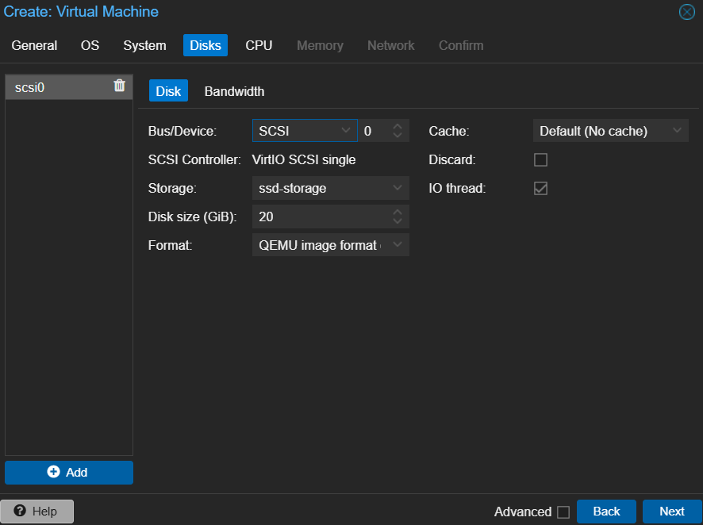

#### Étape 5 : Allocation CPU et mémoire

| Machine    | vCores | RAM   |
|------------|--------|-------|
| PfSense    | 2      | 2 Go  |

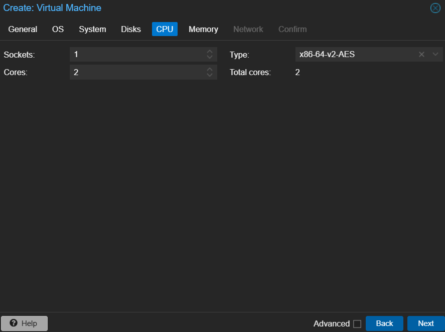
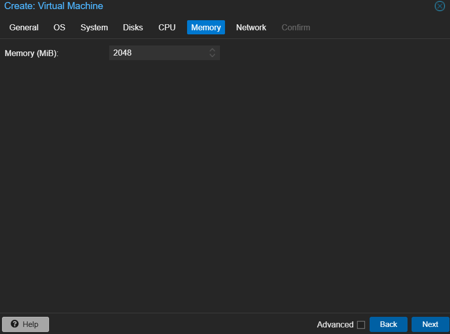

#### Étape 6 : Configuration réseau

- **Réseau :** Sélectionner le réseau approprié pour le pool hackathon
- **Adressage :** DHCP activé lors du déploiement initial
- **Configuration réseau :** Nécessaire lors de l'installation PfSense
- **Documentation réseau :** IP et configuration documentées dans les notes Proxmox

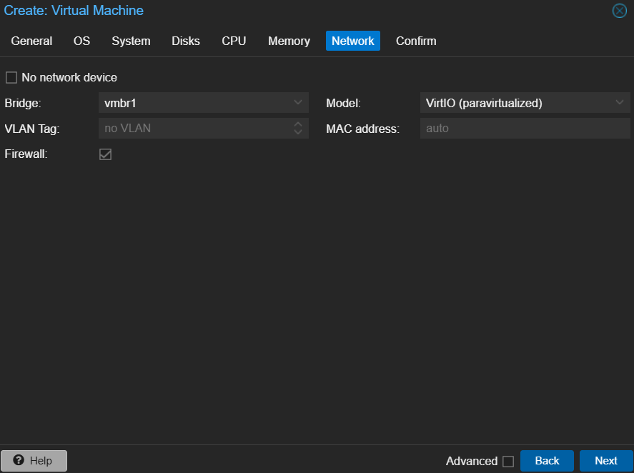

> **Important :** Le montage réseau (network bridging/VLAN) sera configuré lors de l'installation de PfSense

---

## 5. Installation et Configuration de PfSense
# Installation de pfSense sur Proxmox VE

Guide d'installation de pfSense en tant que machine virtuelle sur Proxmox VE avec les recommandations de performance.

## Prérequis

- Proxmox VE installé et fonctionnel
- Accès à l'interface web de Proxmox
- Image ISO de pfSense téléchargée
- Au moins 2 interfaces réseau disponibles (WAN et LAN)

## Téléchargement de pfSense

### 1. Télécharger l'ISO pfSense

Rendez-vous sur : https://www.pfsense.org/download/

- **Architecture** : AMD64 (64-bit)
- **Installer** : DVD Image (ISO) Installer
- **Mirror** : Choisir le plus proche de votre localisation

### 2. Uploader l'ISO sur Proxmox

1. Connectez-vous à l'interface web Proxmox
2. Sélectionnez votre nœud dans l'arborescence
3. Allez dans **local (nom-du-noeud)** > **ISO Images**
4. Cliquez sur **Upload**
5. Sélectionnez l'ISO pfSense téléchargé

## Recommandations de performance

### Configuration matérielle recommandée

| Utilisation | vCPU | RAM | Disque | Notes |
|-------------|------|-----|--------|-------|
| **Petit réseau** (< 20 utilisateurs) | 1-2 | 2 GB | 16 GB | Usage basique |
| **Réseau moyen** (20-100 utilisateurs) | 2-4 | 4 GB | 32 GB | Filtrage + VPN |
| **Grand réseau** (> 100 utilisateurs) | 4-8 | 8 GB | 64 GB | IDS/IPS + packages |

### Recommandations générales

- **Type de CPU** : host (pour meilleures performances)
- **Type de disque** : VirtIO SCSI (meilleur I/O)
- **Cache disque** : Write back (avec batterie/UPS) ou Write through
- **Réseau** : VirtIO (paravirtualisé)
- **BIOS** : SeaBIOS (compatibilité pfSense)

## Création de la VM pfSense

### 1. Créer une nouvelle VM

Dans l'interface Proxmox, cliquez sur **Create VM** en haut à droite.

### 2. Onglet General

- **Node** : Sélectionnez votre nœud Proxmox
- **VM ID** : 100 (ou un ID disponible)
- **Name** : pfsense
- **Resource Pool** : (optionnel)

### 3. Onglet OS

- **Use CD/DVD disc image file (iso)** : Cochez
- **Storage** : local
- **ISO image** : Sélectionnez l'ISO pfSense
- **Guest OS Type** : Other
- **Guest OS Version** : Other

### 4. Onglet System

- **Graphic card** : Default
- **Machine** : Default (i440fx)
- **BIOS** : SeaBIOS
- **SCSI Controller** : VirtIO SCSI single
- **Qemu Agent** : Décoché (pfSense ne supporte pas)

### 5. Onglet Disks

- **Bus/Device** : SCSI
- **Storage** : local-lvm (ou votre stockage préféré)
- **Disk size (GiB)** : 32 (minimum 16 GB)
- **Cache** : Write through (ou Write back si UPS)
- **Discard** : Coché (si SSD)
- **SSD emulation** : Coché (si stockage sur SSD)

### 6. Onglet CPU

- **Sockets** : 1
- **Cores** : 2 (minimum, 4 pour charge élevée)
- **Type** : host
- **Enable NUMA** : Décoché

### 7. Onglet Memory

- **Memory (MiB)** : 4096 (4 GB minimum, 8 GB recommandé pour IDS/IPS)
- **Ballooning Device** : Décoché (pour performances stables)

### 8. Onglet Network

**Interface réseau WAN (net0)** :
- **Bridge** : vmbr0 (ou votre bridge WAN)
- **Model** : VirtIO (paravirtualized)
- **Firewall** : Décoché

Cliquez sur **Finish** pour créer la VM.

### 9. Ajouter l'interface LAN

Après création de la VM :

1. Sélectionnez la VM **pfsense**
2. Allez dans **Hardware**
3. Cliquez sur **Add** > **Network Device**
4. **Bridge** : vmbr1 (ou votre bridge LAN)
5. **Model** : VirtIO
6. **Firewall** : Décoché
7. Cliquez sur **Add**

## Installation de pfSense

### 1. Démarrer la VM

1. Sélectionnez la VM pfsense
2. Cliquez sur **Start**
3. Ouvrez la **Console**

### 2. Installation

1. Au menu de démarrage, attendez le démarrage automatique ou appuyez sur **Entrée**
2. Acceptez les accords de licence
3. Sélectionnez **Install** et appuyez sur **OK**
4. **Keymap Selection** : Sélectionnez votre clavier (ex: French)
5. **Partitioning** : Sélectionnez **Auto (ZFS)** (recommandé) ou **Auto (UFS)**
6. Si ZFS, sélectionnez **Stripe** (pour une seule disque)
7. Sélectionnez le disque virtuel
8. Confirmez l'installation (les données seront effacées)
9. Attendez la fin de l'installation
10. Sélectionnez **Reboot**


*Installation de pfSense en mode console*

### 3. Détacher l'ISO

Avant le redémarrage :
1. Dans Proxmox, sélectionnez la VM
2. Allez dans **Hardware**
3. Sélectionnez **CD/DVD Drive**
4. Cliquez sur **Edit**
5. Sélectionnez **Do not use any media**
6. Cliquez sur **OK**

## Configuration initiale de pfSense

### 1. Attribution des interfaces

Au redémarrage, pfSense va détecter les interfaces réseau :

```
Should VLANs be set up now? [y|n]: n

Enter the WAN interface name: vtnet0
Enter the LAN interface name: vtnet1

Do you want to proceed? [y|n]: y
```

### 2. Configuration de l'adresse IP LAN

1. Choisissez l'option **2) Set interface(s) IP address**
2. Sélectionnez **2 - LAN**
3. Configurez l'adresse IP LAN : `192.168.1.1` (ou votre réseau)
4. Subnet mask : `24`
5. IPv6 : Appuyez sur **Entrée** (skip)
6. Enable DHCP server : **y**
7. Start address : `192.168.1.100`
8. End address : `192.168.1.200`
9. Revert to HTTP : **n** (garder HTTPS)

### 3. Accéder à l'interface web

Depuis une machine sur le réseau LAN, ouvrez un navigateur :

```
https://192.168.1.1
```

**Identifiants par défaut** :
- **Username** : admin
- **Password** : pfsense


*Interface web de pfSense*

---

**Installation terminée !**

---

## X. Support et escalade

**Responsable infrastructure :** Enzo

En cas de problème ou de demande spécifique (créer un nouveau conteneur, modifier l'architecture, etc.), contacter Enzo.

---

## Annexe : Points de contact

- **Infrastructure & Architecture :** Enzo
- **Accès & Permissions :** Enzo

- **Documentation :** A jour au 16/10/2025 à 14:15
