# Procédure de Déploiement d'Infrastructure Hackathon

## Vue d'ensemble

Cette documentation décrit la procédure complète de déploiement de l'infrastructure Hackathon sur le homelab Proxmox hébergé chez Enzo. L'infrastructure est accessible via un tunnel VPN WireGuard et comprend 4 conteneurs LXC (WebServer, BDD, Monitoring, Backup) et 1 machine virtuelle FireWall (PfSense).

**Infrastructure hébergée :** Homelab Proxmox - Enzo <br>
**Pool d'infrastructure :** hackathon (ID 100XXX) <br>
**Système d'exploitation par défaut :** Debian 13 Trixie 

---

## 1. Accès à l'Infrastructure

### 1.1 Accès VPN - WireGuard

L'accès au réseau de l'infrastructure se fait exclusivement via un tunnel VPN WireGuard.

**Procédure :**
1. Demander un bail WireGuard à Enzo
2. Recevoir le fichier de configuration WireGuard (bail de 2 jours)
3. Installer le client WireGuard sur votre machine
4. Importer la configuration fournie
5. Activer la connexion VPN

**Durée du bail :** 2 jours (module Hackathon)

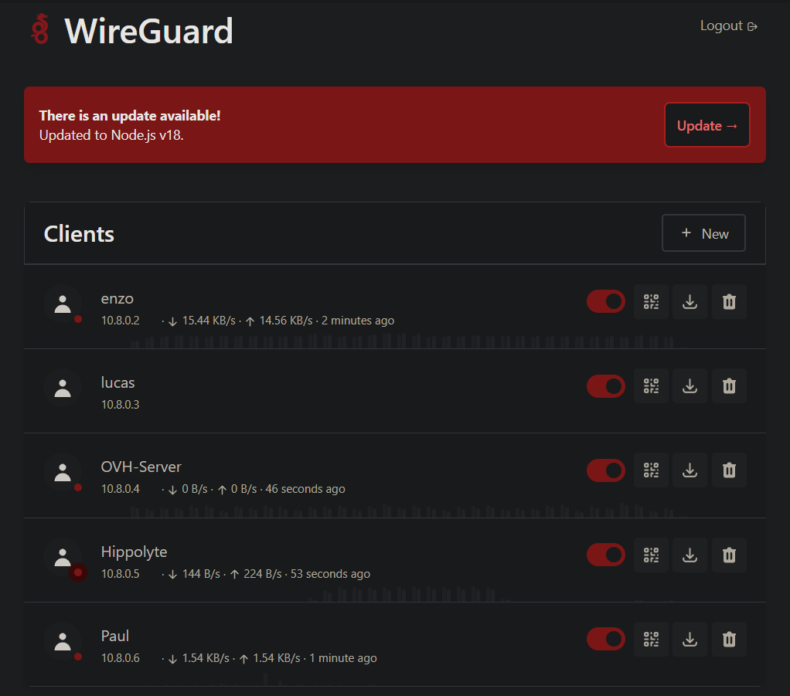

> **Prérequis :** Cette étape est obligatoire avant toute accession au Proxmox

---

## 2. Accès Proxmox

### 2.1 Création des comptes utilisateurs

Chaque utilisateur disposant d'un accès à l'infrastructure possède un compte Proxmox dédié.

**Caractéristiques des comptes :**
- Bail de 2 jours (expiration automatique après 2 jours)
- Accès limité au pool hackathon
- Permissions restreintes (voir section 2.2)

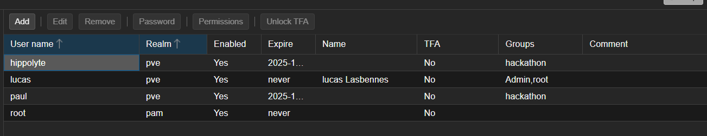

### 2.2 Permissions utilisateurs

Les utilisateurs disposent des permissions suivantes sur le pool hackathon :

**Permissions autorisées :**
- Visualiser le pool hackathon et les machines associées
- Administrer les machines (démarrer, arrêter)
- Accéder à la console de gestion
- Appliquer certaines personnalisations (configuration mineure)

**Permissions restreintes :**
- Création/suppression de LXC : Réservée à Enzo (gestion architecturale)
- Création/suppression de VM : Réservée à Enzo (gestion architecturale)
- Modification de l'architecture réseau : Réservée à Enzo

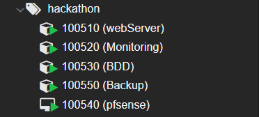
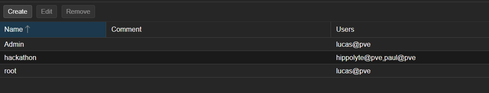

> **Note :** L'architecture de l'infrastructure est réglementée. Seul Enzo peut créer ou modifier les conteneurs et machines virtuelles.

---

## 3. Déploiement des Conteneurs LXC

### 3.1 Conventions de nommage et d'ID

L'infrastructure Proxmox respecte les conventions d'ID suivantes :

- Format ID : `100XXX` où `XXX` correspond à l'environnement/pool
- Pour le pool hackathon : `1005XX` (ex : 100510, 100520, ...)

**Conteneurs déployés :**
- WebServer (ID : 100510)
- BDD (ID : 100520)
- Monitoring (ID : 100530)
- Backup (ID : 100550)

### 3.2 Paramètres de création des LXC

#### Étape 1 : Configuration initiale
- **Pool :** hackathon
- **Clé SSH :** Configuration publique fournie (à définir lors de la création)
- **Template :** Debian 13 Trixie

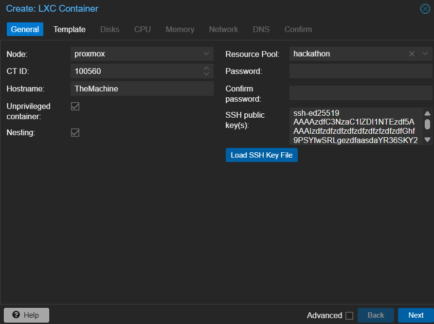

#### Étape 2 : Configuration du template

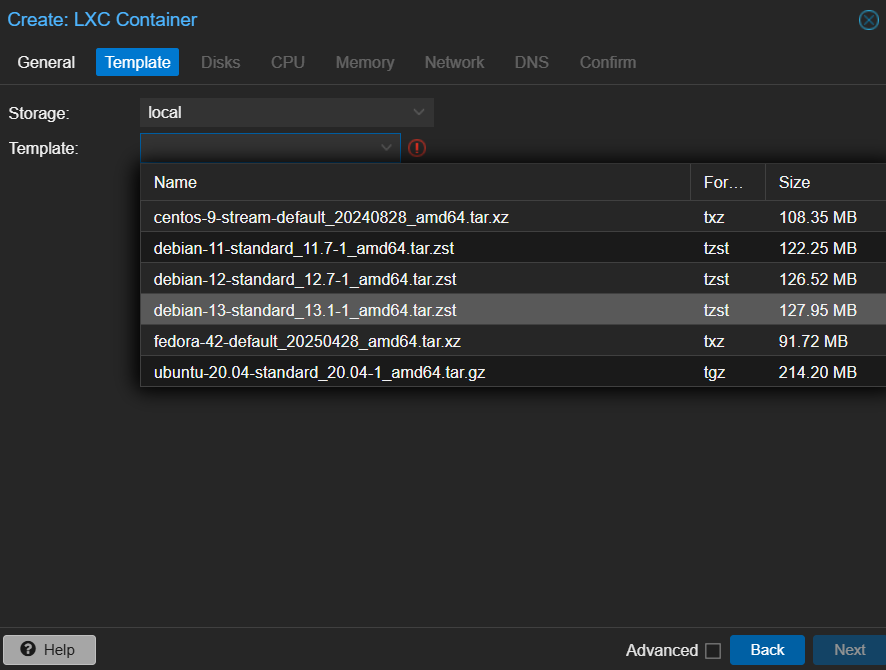

#### Étape 3 : Configuration du stockage disque

Les besoins disque s'adaptent selon la fonction du conteneur :

| Conteneur   | Stockage | Justification          |
|-------------|----------|------------------------|
| WebServer   | 20 Go    | Application web        |
| BDD         | 100 Go   | Base de données        |
| Monitoring  | 30 Go    | Logs et métriques      |
| Backup      | 300 Go   | Stockage des backups   |

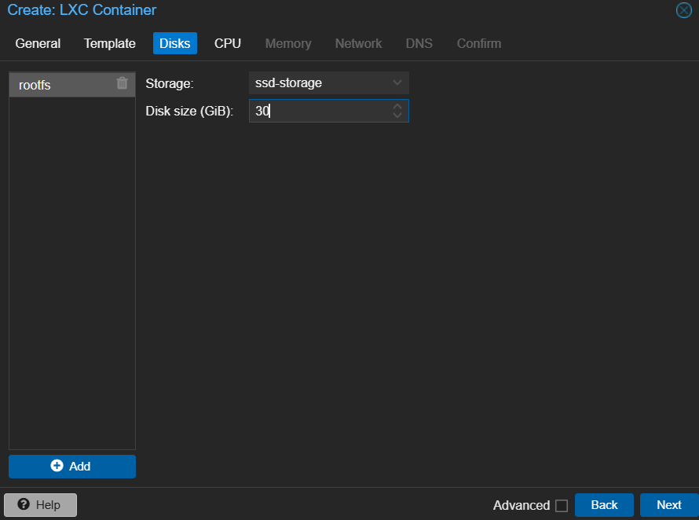

**Convention de stockage :** Respecter les conventions d'infrastructure en place et adapter selon les besoins.

#### Étape 4 : Allocation CPU et mémoire

Les ressources s'adaptent selon la charge anticipée :

| Conteneur   | vCores | RAM   |
|-------------|--------|-------|
| WebServer   | 2      | 2 Go  |
| BDD         | 2      | 2 Go  |
| Monitoring  | 2      | 2 Go  |
| Backup      | 2      | 2 Go  |

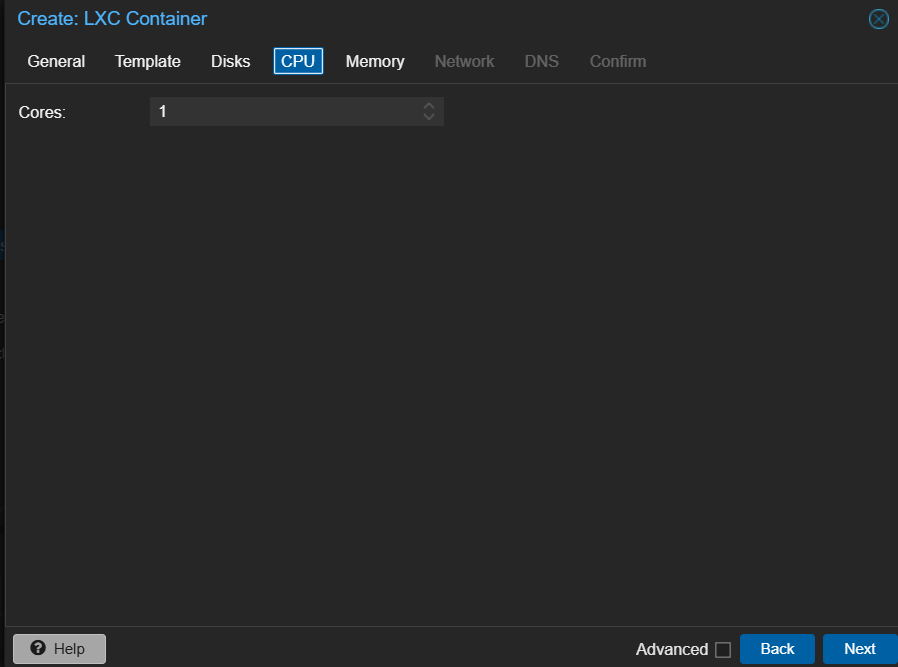
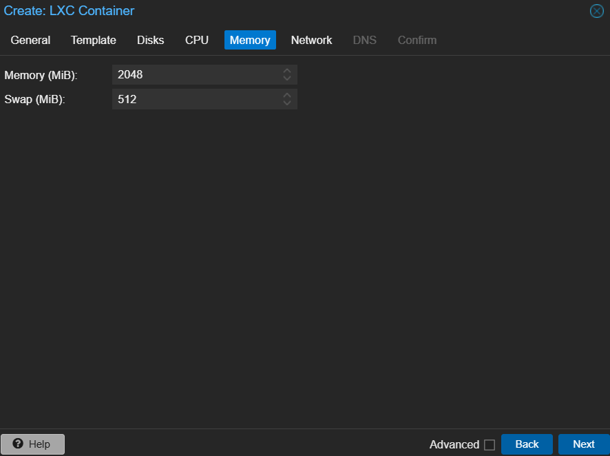

#### Étape 5 : Configuration réseau

- **Réseau :** Sélectionner le réseau approprié pour le pool hackathon
- **Adressage :** DHCP activé
- **Bail DHCP :** Automatiquement attribué à chaque conteneur
- **Documentation réseau :** Les IPs attribuées apparaissent automatiquement dans les notes Proxmox

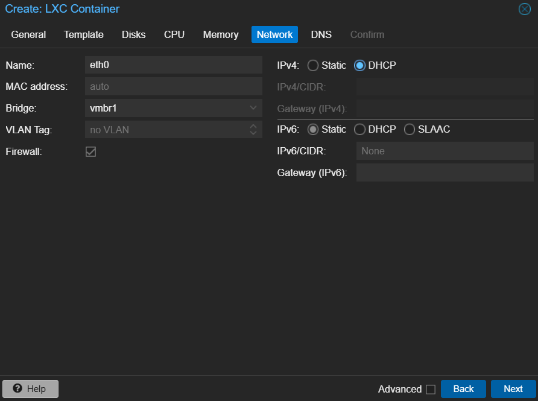
Et l'arriver de l'addressage DHCP dans les notes Proxmox :
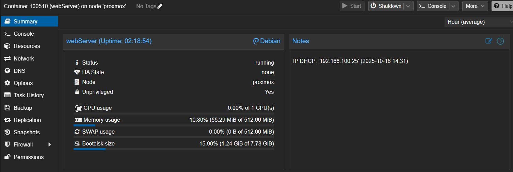

### 3.3 Installation et configuration commune des LXC

Tous les conteneurs suivent la même procédure d'installation et de configuration :

#### Étape 1 : Mise à jour du système
```bash
apt update
apt upgrade -y
```

#### Étape 2 : Configuration SSH
- Authentification par clé SSH uniquement (password login désactivé)
- Accès root autorisé uniquement via clé SSH
- Désactiver l'authentification par mot de passe dans SSH

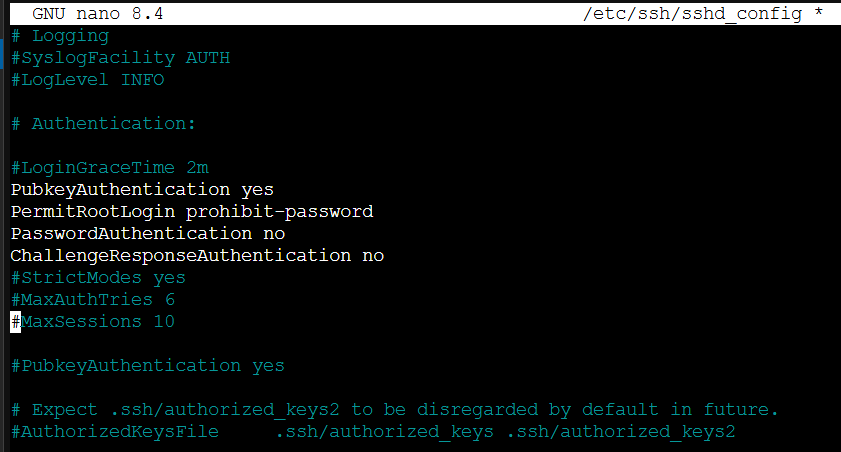

#### Étape 3 : Installation de Docker et Docker Compose
```bash
# Mise à jour des paquets
apt install -y ca-certificates curl gnupg lsb-release

# Ajout la clé GPG officielle
mkdir -p /etc/apt/keyringssystemctl enable docker
curl -fsSL https://download.docker.com/linux/debian/gpg | gpg --dearmor -o /etc/apt/keyrings/docker.gpg

# Ajout du repository Docker
echo "deb [arch=$(dpkg --print-architecture) signed-by=/etc/apt/keyrings/docker.gpg] https://download.docker.com/linux/debian $(lsb_release -cs) stable" | tee /etc/apt/sources.list.d/docker.list > /dev/null
```
```bash
# Mise à jour des paquets
apt update

# Installation de  Docker Engine
apt install -y docker-ce docker-ce-cli containerd.io docker-buildx-plugin docker-compose-plugin

# Démarrer et activer Docker
systemctl start docker
systemctl enable docker
```

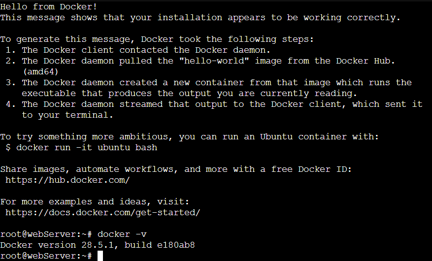

#### Étape 4 : Snapshot de référence

Une fois l'installation complète, procéder à un snapshot du conteneur dans son état stable :
- **Objectif :** Point de référence stable pour redéploiements rapides
- **Bénéfice :** Éviter une réinstallation complète en cas de besoin
- **Naming :** Snapshot nommé `base-install` ou `stable-reference`

![Snapshot de référence créé]
![dockercompose-install.png]

---

## 4. Déploiement de la Machine Virtuelle - PfSense Firewall

### 4.1 Conventions de nommage et d'ID

La machine virtuelle firewall suit les mêmes conventions d'ID que les LXC :

- **Format ID :** `100XXX` (pool hackathon = 100500)
- **VM ID :** 100540
- **Nom :** PfSense-Firewall

### 4.2 Paramètres de création de la VM

#### Étape 1 : Configuration initiale
- **Pool :** hackathon
- **ISO :** Netgate PfSense 2.8
- **Système d'exploitation :** PfSense (FreeBSD based)

![Configuration initiale VM - Étape 1]

#### Étape 2 : Sélection de l'ISO

![Sélection ISO Netgate PfSense 2.8]

#### Étape 3 : Configuration système

Configuration minimale appropriée pour les besoins du firewall :
- **Type de processeur :** Adapté à la performance requise
- **BIOS :** Configuration standard Proxmox
- Autres paramètres système au minimum nécessaire

![Configuration système VM]

#### Étape 4 : Configuration du stockage disque

| Machine    | Stockage | Justification |
|------------|----------|---------------|
| PfSense    | 20 Go*   | OS + Config   |

*Peut être réduit selon les besoins, 20 Go est une allocation confortable

![Configuration stockage VM]

#### Étape 5 : Allocation CPU et mémoire

| Machine    | vCores | RAM   |
|------------|--------|-------|
| PfSense    | 2      | 2 Go  |

![Configuration CPU et mémoire VM]

#### Étape 6 : Configuration réseau

- **Réseau :** Sélectionner le réseau approprié pour le pool hackathon
- **Adressage :** DHCP activé lors du déploiement initial
- **Configuration réseau :** Nécessaire lors de l'installation PfSense
- **Documentation réseau :** IP et configuration documentées dans les notes Proxmox

![Configuration réseau VM]

> **Important :** Le montage réseau (network bridging/VLAN) sera configuré lors de l'installation de PfSense

---

## 5. Installation et Configuration de PfSense


---

## X. Support et escalade

**Responsable infrastructure :** Enzo

En cas de problème ou de demande spécifique (créer un nouveau conteneur, modifier l'architecture, etc.), contacter Enzo.

---

## Annexe : Points de contact

- **Infrastructure & Architecture :** Enzo
- **Accès & Permissions :** Enzo
- **Documentation :** A jour au 16/10/2025 à 14:15