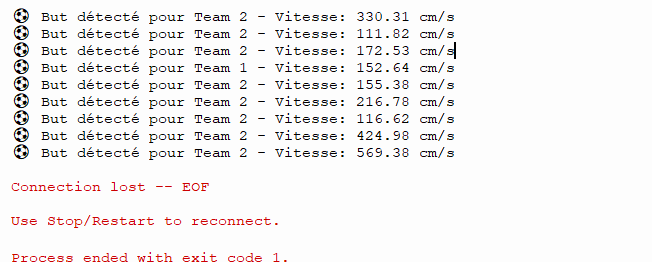

# Hackathon - Ynov Toulouse 2025 : Babyfoot du futur - IoT & Mobile - Systèmes Embarqués

## Equipe

- IoT/Mobile / Systèmes Embarqués 1 : Fauré Léo

## Objectif général

Ce projet vise à **moderniser l’expérience utilisateur autour d’un babyfoot** grâce à un dispositif IoT capable de :
- détecter automatiquement les buts via des **capteurs ultrasoniques**,
- jouer un **son de victoire** pour chaque équipe,
- et envoyer les données de score (vitesse, équipe) à une **API web** pour un suivi en temps réel.

---

## Architecture du système

### Matériel utilisé

| Composant | Description | Rôle |
|------------|-------------|------|
| **ESP32** | Microcontrôleur Wi-Fi | Cerveau du système, mesure, calcule, envoie les données |
| **2 capteurs HC-SR04** | Capteurs à ultrasons | Détection de la balle dans le but |
| **2 buzzers passifs** | Haut-parleurs piézo | Signal sonore lors d’un but |
| **Câbles Dupont** | Connexions électriques | Liaison entre les composants |
| **Alimentation 5V** | USB ou batterie | Fournit l’énergie au système |

📷 *Schéma de câblage fait avec Wokwi :*  


---

## Fonctionnement

1. Chaque but est équipé d’un **capteur ultrasonique (HC-SR04)**.
2. L’ESP32 mesure la distance à intervalles réguliers.
3. Une **variation rapide de distance** indique le passage de la balle.
4. Si la vitesse détectée dépasse un seuil (par défaut `100 cm/s`), un **but est confirmé**.
5. Le système :
   - Joue un **thème sonore (Mario)** via le buzzer.
   - Envoie une requête **HTTP POST** à l’API `/api/goals` :
     ```json
     {
       "vitesse": 124.3,
       "team": 1
     }
     ```

---

## Code principal (MicroPython)

Le fichier `main.py` gère :
- la lecture des capteurs,
- le calcul de la vitesse de la balle,
- l’envoi des données à l’API,
- et la lecture du son de but.

L’application repose sur :
- `machine.Pin`, `PWM`, `time_pulse_us` pour la gestion matérielle,
- `urequests` pour les requêtes HTTP,
- un seuil de vitesse ajustable via la variable `vitesseSeuil`.

---

## Communication avec l'API

- **Méthode** : `POST`
- **Route** : `/api/goals`
- **Payload JSON** :
  ```json
  {
    "vitesse": <float>, 
    "team": <int>
  }
  ```
- **Réponse attendue** : code HTTP 200 en cas de succès.

---

## Connexion Wi-Fi (à ajouter au boot.py)

Avant le lancement du script principal :

```python
import network, time

ssid = "TON_SSID"
password = "TON_MOT_DE_PASSE"

wlan = network.WLAN(network.STA_IF)
wlan.active(True)
wlan.connect(ssid, password)

while not wlan.isconnected():
    time.sleep(0.5)

print("✅ Connecté au Wi-Fi :", wlan.ifconfig())
```

---

## Déploiement

1. Flasher MicroPython sur ton ESP32.
2. Uploader les fichiers :
   - `main.py` (code principal)
   - `boot.py` (connexion Wi-Fi)
3. Démarrer le module → Le système détecte automatiquement les buts.

---

## Perspectives d'évolution

- ajouter 2 afficheur a 7 segment afin de voir la vitesse en temp réel
- pouvoir crée ou changer de musique comme bon nous semble
- mettre un écran lcd, afin de mettre des phrases de nargue tels que :
    - "11 - 0, team 2 dois passer sous le baby"
    - "team 2, a perdu, bouuut"
    - ...

---

## Analyse et justification des choix matériels

| Choix | Justification |
|-------|---------------|
| **ESP32** | Connectivité Wi-Fi native, faible coût, compatibilité MicroPython |
| **HC-SR04** | Simple, précis pour la détection à courte distance |
| **Buzzer passif** | Compact et facilement pilotable en PWM (musique mario) |
| **Alimentation USB 5V** | Standard et facilement rechargeable |

---

## Analyse de coût estimée

| Élément | Quantité | Coût unitaire (€) | Total (€) |
|---------|----------|-------------------|-----------|
| ESP32 | 1 | 8.00 | 8.00 |
| HC-SR04 | 2 | 2.50 | 5.00 |
| Buzzer | 2 | 1.00 | 2.00 |
| Câblage & divers | - | 2.00 | 2.00 |
| Breadboard (ou poste à fer à souder + étain + décapant) | 1 | 5.00 - 40.00 | 5.00 - 40.00 |
| **Total** | | | **≈22.00 - 57€ €** |

les prix peuvent varier selon les site où on les achetent, par exemple sur aliexpress sera moins cher


### Analyse Logs

📷 *log :*  


| Équipe | Nombre de buts détectés | Vitesse moyenne (cm/s) | Vitesse max (cm/s) |
|---------|--------------------------|------------------------|--------------------|
| **Team 1** | 1 | 152.64 | 152.64 |
| **Team 2** | 8 | 262.60 | 569.38 |

### Interprétation

- **Team 2** domine largement en nombre de buts détectés et en vitesse moyenne de balle (≈ 2,6 m/s).  
- La **vitesse maximale** enregistrée (569.38 cm/s ≈ 5,7 m/s) est cohérente avec une frappe rapide typique d’un tir de babyfoot.  
- **Team 1**, bien que moins performante quantitativement, affiche une vitesse correcte (~1,5 m/s).  

Ces valeurs suggèrent que :
- Le **système de détection est réactif** et différencie correctement les tirs lents et rapides.  
- La plage de détection (entre 100 et 600 cm/s) est réaliste pour un usage réel.  
- De légères variations peuvent provenir des différences d’angle de tir ou de la position de la balle face au capteur.  

