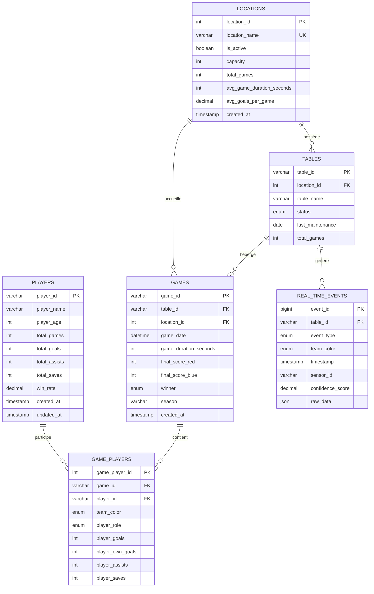

# Schéma de Base de Données - Diagramme ERD

## Relations clés

- **1 Joueur** → **N Participations** (GAME_PLAYERS)
- **1 Partie** → **4 Participations** (2 Rouge, 2 Bleu)
- **1 Lieu** → **N Tables** → **N Parties**
- **1 Table** → **N Événements temps réel** (IoT)

## Contraintes d'intégrité

### Basées sur l'analyse EDA

1. **Âges réalistes**: 12 ≤ player_age ≤ 65
2. **Durées valides**: 60s ≤ game_duration ≤ 3600s
3. **Scores plausibles**: 0 ≤ final_score_* ≤ 10
4. **Buts individuels**: player_goals ≤ 10
5. **Équipes équilibrées**: 2 joueurs Rouge + 2 joueurs Bleu par partie

---

Généré depuis l'analyse EDA - Voir `DATABASE_RECOMMENDATIONS.md` pour détails complets.
